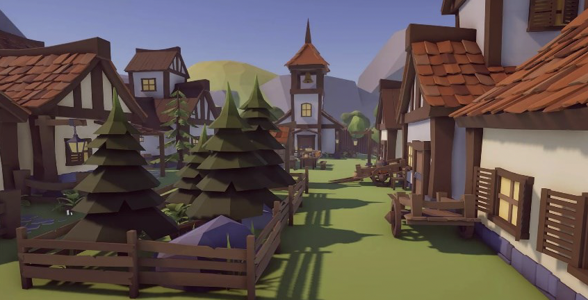
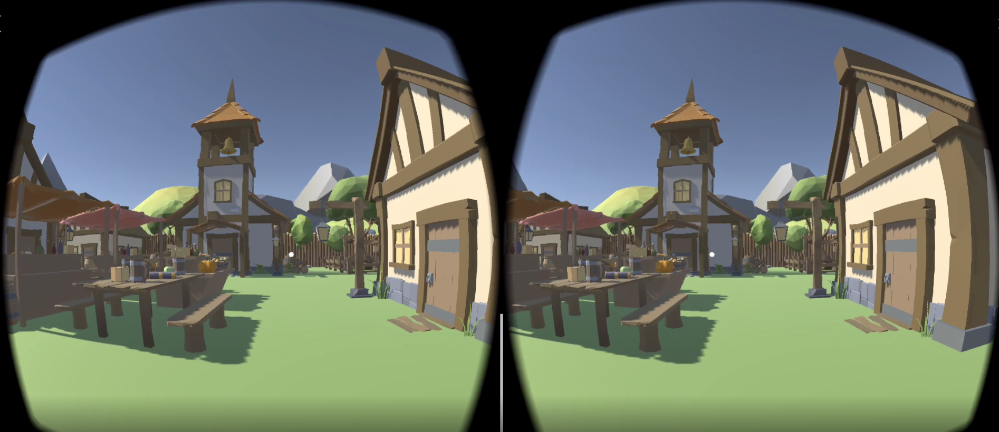

# Building a VR App on Mobile Phone

This project I developed how to target a VR App on a mobile phone, navigate using the phone’s capabilities, and display a scene in stereo using Google Cardboard. The model displayed is a low polygon medieval village from Unity assets.

To guide you at developing this App, here are the step-by-step tutorials on how to transfer a unity model on your mobile phone:
• For Android, please follow the following instructions:
o https://docs.unity3d.com/Manual/android.html
o https://developers.google.com/unity/packages#android
o How to Build a Unity Game to Android
• For IOS, please follow the following instructions:
o https://docs.unity3d.com/Manual/iphone.html
o How to Build a Unity Game to iOS
You can choose which OS to use based on your mobile device.
Once the App is ported, I would like you to add the following to the mobile phone capabilities:

• Part I: In mono mode (no cardboard VR), please develop a way to navigate the virtual world by pointing with your finger on the screen using basic gestures such as:

• You can use Mobile device input https://docs.unity3d.com/Manual/MobileInput.html
• Part II: I would like you to implement navigation in the virtual world by using the magnetic clicker provided with the Google cardboard. The main idea is that once you click, you should move slowly in the direction you are looking with your cardboard.